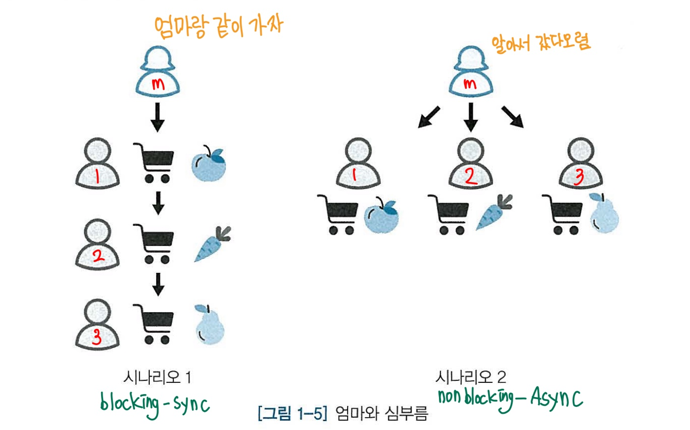

# 동기와 비동기, 블로킹과 논블로킹

책 ~~백견불여일타~~ 을 보다가 동기적처리 방식과 비동기적 처리 방식에 대한 재미있는 예제가 있어서 가져왔습니다.

엄마랑 아이 3명이 장을 보러 갔습니다. 세 아이에게 각각 사과, 당근, 배를 가져오라고 시켰을 때 **두가지 시나리오**가 있습니다.

- 첫번째는, 아이가 너무 어려서 엄마가 **카트 1개**만을 들고 아이들이 물건을 잘 고르고 잘 담는지 확인해야 하는 경우입니다. 엄마는 아이를 따라다니며 1번 아이가 카트에 사과를 잘 담는지 확인한 후 2번 아이가 당근을 잘 담는지 지켜봅니다. 2번 아이가 카트에 당근을 담으면 3번 아이가 배를 잘 담는지 따라가겠죠??

- 두번째는 아이들이 알아서 잘 할거라고 믿고 각각 카트를 쥐어주고 다녀오라고 하는 경우입니다. ~~방생~~ 
아이들은 각각 맡은 물건을 가지고 오는대로 엄마의 카트에 담습니다.

---

첫번째 시나리오는 엄마의 카트 1개만을 가지고, 아이 한명이 심부름할 때 다른 아이에게 기회, 제어권을 주지 않습니다. 
이렇게 __제어권을 넘겨주지 않고 대기하게 만드는 것__ 을 **블로킹**이라고 합니다.  
또 각 아이들에게 한명씩 심부름을 시켰는데 이는 작업 흐름이 순차적인 동기(Synchronous)방식입니다. 
즉 첫번째 시나리오의 엄마는 **블로킹/동기(Blocking-Sync)** 방식으로 아이들을 키우고 계시네요

 

두번째 시나리오는 심부름하는 아이들에게 따로 요구하거나 막은게 없습니다. __다른 작업과 관계없이 일을 수행할 수 있는 논블로킹__ 방식이겠네요.
아이들에게 심부름을 한꺼번에 시켰는데, 이는 작업의 흐름이 순차적이지 않은 비동기적(Asynchronous) 방식입니다.  
두번째 엄마는 **논블로킹/비동기(NonBlocking-Async)** 방식을 선호하시나 봅니다.

---
이중 Node.js는 자기주도학습을 선호하는 k-트렌드에 따라 두번째 엄마에 가깝습니다.  
시나리오에서 나온 카트는 프로그램을 실행하는데 필요한 자원, CPU라고 생각하면 이해가 쉬워집니다.  
블로킹/동기방식은 CPU를 사용하고, 작업이 끝났다는 응답이 올 때까지 기다리다 보면 그 시간동안 자원을 낭비한다는 문제가 생깁니다. 빨리 끝나야 장보는 시간도 짧아지고 다른 아이들이 덜 기다리게 될 테니까요.

**따라서,  
Node.js는 논블로킹/비동기(NonBlocking-Async)방식을 사용합니다.**