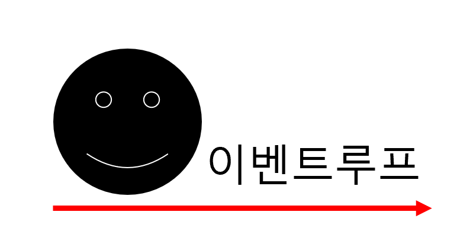
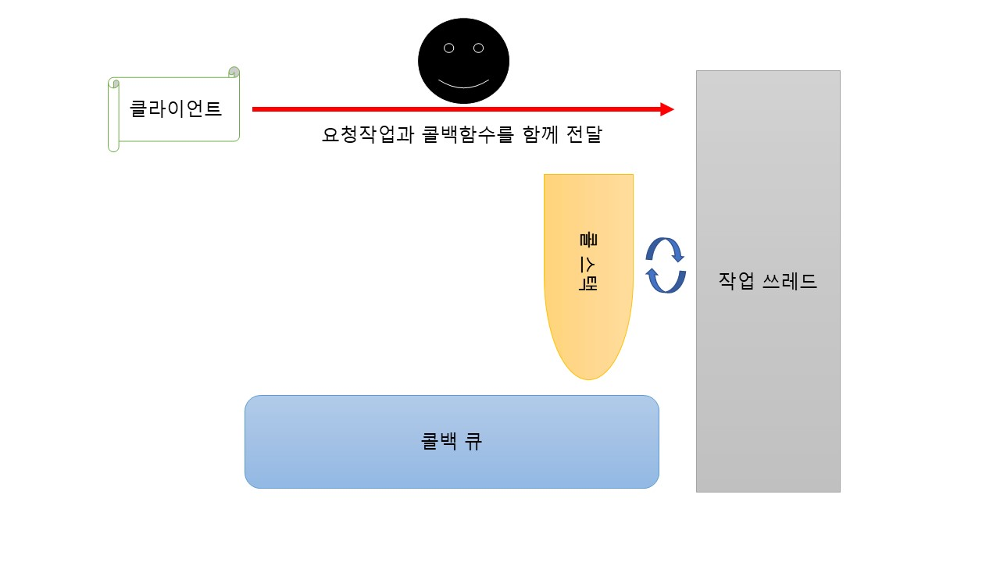
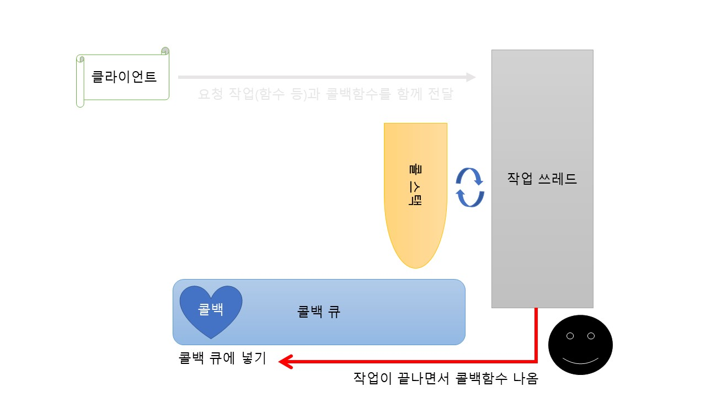
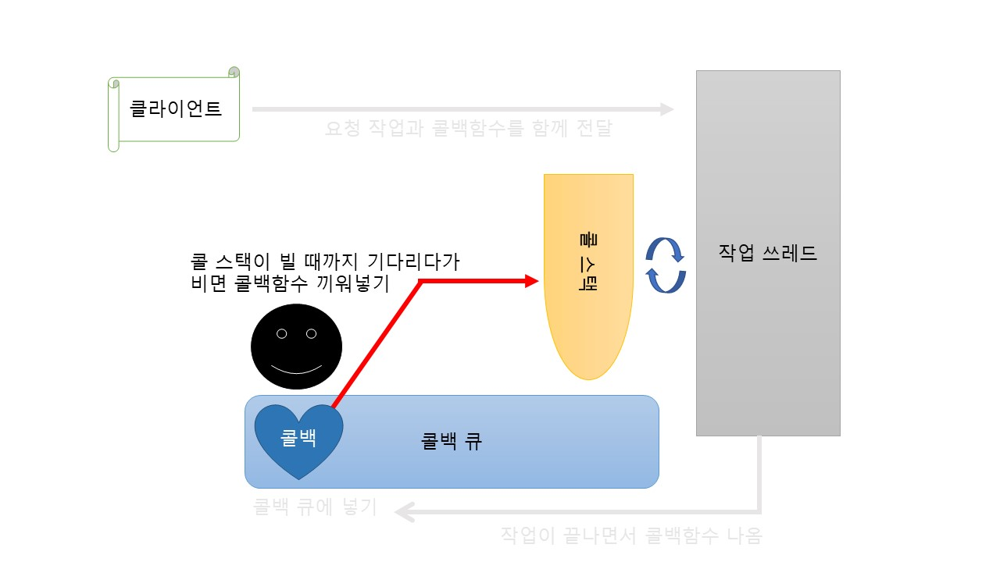
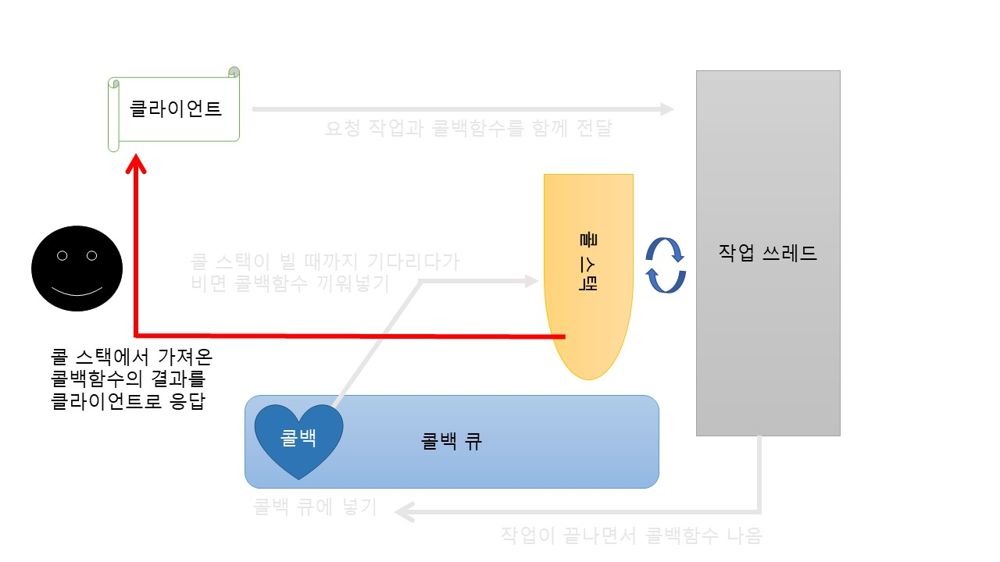

# event loop와 Nodejs의 구동방식 [기본편]

설명을 하기 전에 용어부터 알고 가는 것이 좋겠습니다
### 용어정리
* **쓰레드** : 경령화된 프로세스, 지금 실행중인 크롬 브라우저를 하나의 프로세스라고 생각할 때, 브라우저 내부에서 구글에 로그인하고, 구글에 event loop가 뭔지 검색하는 작업을 수행하는 것이 쓰레드입니다.
* **작업 쓰레드** : nodejs에서 이벤트를 처리하는 작업공간
* **콜백 큐(작업 큐)** : 이벤트 발생 후 호출돼야 할 작업을 기다리는 자료구조 ~~스택으로 가기 전 보관 창고~~
* **콜 스택** : 함수의 호출을 기록하는 자료구조, 실행중인 작업이 끝났을 때 어느 실행부분으로 돌아갈지 보관 ~~여기있으면 언능 실행해라~~
* **이벤트 루프** :  콜 스택을 감시하다가 마침 비어있으면, 콜백 큐의 작업을 콜 스택으로 밀어넣어줌
* **콜백 함수** : 작업이 끝나면 실행하는 함수

---

프로그램을 실행하기 전에, Nodejs는 *싱글쓰레드*입니다. 말 그대로 쓰레드가 하나라는 뜻입니다. 
## 싱글쓰레드인데 어떻게 처리 속도가 빠를 수 있을까요?? 
  HI I am event loop!

그 이유는 **이벤트 루프(event loop)** 에 있습니다.

1. 이벤트 루프는 하나의 작업을 콜백 함수와 함께 작업 쓰레드로 보냅니다.  

2. 작업은 함수 단위로 콜 스택에 쌓입니다. 

3. 비동기적 특징으로, 작업이 끝났다는 응답을 기다리지는 않습니다. 다만 작업이 종료되면, 쓰레드는 콜백 함수를 실행하고 싶다고 이벤트 루프에 요청합니다. 

4. 이벤트 루프는 그 요청을 받고 콜백 함수를 콜백 큐에 등록합니다.

5. 이벤트 루프가 콜 스택의 작업이 종료됐을 때를 기다렸다가, 콜백 큐에 있는 콜백함수를 콜 스택에 올립니다.

6. 콜백함수의 결과를 클라이언트에 전송하여 사용자에게 제공합니다.

여기까지가 기본 Nodejs의 기본 구동 방식입니다.  
하지만, 사실 힙 영역과 WebAPI 등 생략한 부분도 존재합니다.

이것은 다음에 **[심화편]** 에서 다뤄보도롤 할게요 힛

